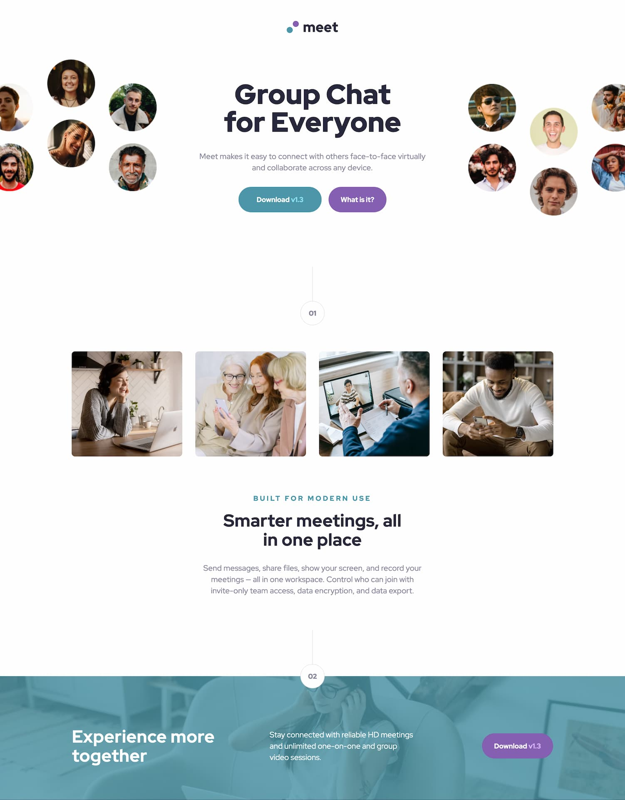

# Frontend Mentor - Meet landing page solution

This is a solution to the [Meet landing page challenge on Frontend Mentor](https://www.frontendmentor.io/challenges/meet-landing-page-rbTDS6OUR). Frontend Mentor challenges help you improve your coding skills by building realistic projects.

## Table of contents

- [Overview](#overview)
  - [The challenge](#the-challenge)
  - [Screenshot](#screenshot)
  - [Links](#links)
- [My process](#my-process)
  - [Built with](#built-with)
  - [What I learned](#what-i-learned)
  - [Continued development](#continued-development)
- [Author](#author)
- [Acknowledgement](#acknowledgement)

## Overview

### The challenge

Users should be able to:

- View the optimal layout depending on their device's screen size
- See hover states for interactive elements

### Screenshot



### Links

- Solution URL: [https://www.frontendmentor.io/solutions/meet-landing-page-scss-bem-grid-flexbox-zztleF0Y-Q](https://www.frontendmentor.io/solutions/meet-landing-page-scss-bem-grid-flexbox-zztleF0Y-Q)
- Live Site URL: [https://incandescent-cupcake-1d9122.netlify.app/](https://incandescent-cupcake-1d9122.netlify.app/)

## My process

- Setup the project structure for my workflow with scss
- Setup the scss variables based on the design system provided
- Start implementing the mobile version
- Refactor code with mixins
- Add breakpoints for tablet and desktop
- Refactor some sizes with clamp for fluid changes between breakpoint
- Finetuning with perfectPixel to get closer to the design

### Built with

- Semantic HTML5 markup
- SCSS
- BEM
- Flexbox
- CSS Grid
- Mobile-first workflow

### What I learned

I learned how to make image float outside of the screen size (1440px) but make
them still visible for larger screen.

The parent needs to have an overflow hidden and the max-width need to be large enough to contain the overflowed image.

```css
&__illustration__image {
  max-width: calc(100% + 4rem);
  margin-left: -2rem;
}
```

I learned more about accessibility and images.

A `title` isn't needed to label a link. the title attribute is problematic for accessibility.

[More about the title attribute on MDN](https://developer.mozilla.org/en-US/docs/Web/HTML/Global_attributes/title)

- Images should always have an alt attribute
- Screen readers will read the file name or just say "image" if the image doesn't have the alt attribute
- Screen readers will skip the image when the alt attribute is present but empty. This is ok for **decorative images**
- Some user agents place inline svg into the focus order. It is advised to add `focusable="false"` to the svg.
- `alt` should never repeat on a page.
- if some images are similar and have the same purpose we can add an alt attribute to the first one and keep the other ones empty.

### Continued development

I'll keep refactoring the html and scss. I have the feeling there are a lot of small
tweaking on individual elements such as font-sizes, line-height, letter-spacing that could be harmonised and easier to handle.

## Author

- Website - [Gwenaël Magnenat](https://gmagnenat.com)
- Frontend Mentor - [@gmagnenat](https://www.frontendmentor.io/profile/gmagnenat)
- LinkedIn - [@gmagnenat](https://www.linkedin.com/in/gmagnenat)

## Acknowledgement

Thank you to [Grace Snow](https://www.frontendmentor.io/profile/grace-snow) for her insightful feedbacks on accessibility.
